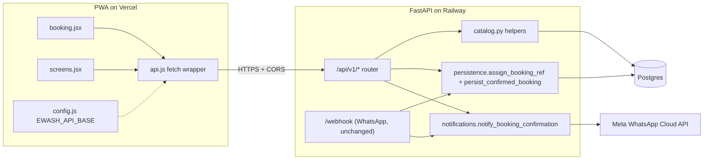

## Goals

- Single source of truth for catalog, pricing, and bookings: the same Postgres-backed domain logic that the WhatsApp bot uses today.
- PWA stops fabricating data (`'EW-2026-' + random` in [mobile-app/booking.jsx](mobile-app/booking.jsx#L1010)) and instead hydrates the entire booking flow from a single `GET /api/v1/bootstrap` round-trip and writes via `POST /api/v1/bookings`.
- Confirmed PWA bookings flow through `assign_booking_ref` + `persist_confirmed_booking(source="api")` + `notify_booking_confirmation` (scheduled as a `BackgroundTask`) exactly like WhatsApp confirmations do, so admin dashboards, monotonic `EW-YYYY-####` refs, and staff alerts work out of the box. A new `bookings.source` column distinguishes PWA from WhatsApp from admin-created bookings for analytics.
- Build pipeline decision: **keep the in-browser JSX setup** (CDN React + `@babel/standalone`). Add a tiny `mobile-app/config.js` loaded before `app.jsx` to expose `window.EWASH_API_BASE`, and a `mobile-app/api.js` exposed as `window.EwashAPI`. A Vite migration is a worthwhile follow-up but explicitly out of scope here to keep the surgery small.
- Auth: **none on writes, token-scoped on reads**. The PWA is anonymous — phone is captured at the booking recap step. On successful booking the server mints an opaque `bookings_token` returned exactly once and stashed in `localStorage["ewash.bookings_token"]`. The My Bookings tab sends this token in `X-Ewash-Token` to fetch the customer's own history. There is no `?phone=` query param on the read path — phone enumeration is impossible by construction. Cross-device booking history is explicitly out of scope for v1; a future WhatsApp-delivered magic link can recover it without re-introducing enumerability. Writes remain fully unauthenticated, matching the WhatsApp bot's trust model and bounded by rate limits + the human eWash-confirmation step before any slot is committed.

## Architecture



The PWA and WhatsApp bot become two clients of the same domain core. No new persistence, no new ref generator, no parallel pricing logic.

## Backend changes

### New file: `app/api.py`

A FastAPI router mounted at `/api/v1`. Implements:

- `GET /api/v1/bootstrap?category=A&promo=YS26` — **single round-trip endpoint the PWA uses on booking-flow open**. Returns `{categories, services:{wash,detailing}|{moto}, centers, time_slots, closed_dates}`. `Cache-Control: public, max-age=60, stale-while-revalidate=300` plus an `ETag` derived from `max(updated_at)` across the catalog tables — unchanged catalogs return 304. Cuts mobile latency on flow open from 5 sequential fetches to 1.
- `GET /api/v1/catalog/categories` — returns `[{id:"A",label,sub,kind:"car"}, ..., {id:"MOTO",...}]`. Mirrors [app/catalog.py](app/catalog.py#L34) `VEHICLE_CATEGORIES`. Retained alongside the bootstrap endpoint for the admin portal and future clients.
- `GET /api/v1/catalog/services?category=A&promo=YS26` — returns two groups (`wash`, `detailing`) for cars, or one moto list. Each row has `{id, name, desc, price_dh, regular_price_dh}` (the latter populated when a promo discount is active so the PWA can render strike-through). Calls `catalog.service_price(sid, category, promo_code=...)` so prices match the bot exactly. Promo code, when invalid, is silently ignored (same UX as the bot today).
- `GET /api/v1/catalog/centers` — wraps `list_centers()` ([app/catalog.py](app/catalog.py#L508)).
- `GET /api/v1/catalog/time-slots?date=YYYY-MM-DD` — wraps `list_time_slots()` ([app/catalog.py](app/catalog.py#L462)) and, when `date` is supplied, **server-filters out any `(date, slot)` less than 2 hours in the future relative to `Africa/Casablanca`**. The current PWA-side `now+2h` filter is preserved for snappy UX but is decorative — server authority overrules so a client with a wrong clock or in a different timezone cannot submit a stale slot.
- `GET /api/v1/catalog/closed-dates` — wraps `list_closed_dates()` ([app/catalog.py](app/catalog.py#L431)) for the calendar UI to grey out unavailable days.
- `POST /api/v1/promos/validate` — body `{code, category}` → `{valid, label, discounted_prices: {svc_id: price_dh}}` or 404. Convenience for the dedicated promo step in the PWA.
- `POST /api/v1/bookings` — see body shape below. Server validates inputs, recomputes price, allocates `EW-YYYY-####` via `persistence.assign_booking_ref` ([app/persistence.py](app/persistence.py#L184)), persists via `persistence.persist_confirmed_booking` ([app/persistence.py](app/persistence.py#L731)) with `source="api"`, and schedules `notifications.notify_booking_confirmation` via FastAPI `BackgroundTasks` (see below). Returns `{ref, status:"pending_ewash_confirmation", price_dh, total_dh, vehicle_label, service_label, slot, location_label, bookings_token}`. The token is returned exactly once; the PWA persists it to `localStorage["ewash.bookings_token"]`. Subsequent POSTs for the same phone reuse the existing token (don't rotate per booking — that breaks the Bookings tab on the previous device).
- `GET /api/v1/bookings` — required header `X-Ewash-Token: <opaque>`. Returns the recent bookings owned by the token's customer (status, ref, date, slot, service, total, location_label). 401 if the token is missing or unknown. The token is minted by `POST /api/v1/bookings` and stored hashed (SHA-256) in `customer_tokens(token_hash, customer_phone, created_at, last_used_at)` — a DB dump never yields active session tokens.

**Validation contract** for `POST /api/v1/bookings` (all enforced server-side via Pydantic models + catalog cross-checks before any DB write):

- `phone` is parsed and normalized via the same `notifications._normalize_phone_number` the WhatsApp path uses (digits-only, 8-20 chars). Bookings dedupe to the same `customers.phone` row regardless of whether the customer typed `+212 6 11 20 45 02` in the PWA or messaged from `212611204502` on WhatsApp.
- `category` ∈ `catalog.VEHICLE_CATEGORIES`.
- `service_id` exists AND its `vehicle_lane` matches the requested category (a moto service requested for a car is rejected; a car service requested for a moto is rejected).
- Every `addon_ids[*]` exists in `catalog.SERVICES_DETAILING`.
- `center_id` (only when `location.kind == "center"`) exists in `catalog.active_centers()`.
- `slot` exists in `catalog.active_time_slots()` and `date` is not in `catalog.active_closed_dates()`.
- `(date, slot)` is at least 2 hours in the future relative to server-side `Africa/Casablanca`.
- Free-text fields trimmed and length-capped: `note` ≤ 500 chars, `address_details` ≤ 200 chars, vehicle `make`/`color`/`plate` ≤ 64 chars each. Control characters stripped.
- Returns 400 with a stable `{error_code, message}` body on any rejection; the PWA renders the message inline on the failing step.

Request body for `POST /api/v1/bookings`:

```json
{
  "phone": "+212611204502",
  "name": "Youssef",
  "category": "A",
  "vehicle": { "make": "Clio", "color": "Bleu", "plate": "12345-A-6" },
  "location": {
    "kind": "home",
    "pin_address": "173 Bd Anfa",
    "address_details": "3e etage"
  },
  "promo_code": "YS26",
  "service_id": "svc_ext",
  "date": "2026-05-20",
  "slot": "09:00-10:00",
  "note": "Sonner deux fois",
  "addon_ids": ["cuir", "plast"],
  "client_request_id": "uuid-v4",
  "bookings_token": "<existing-token-if-any>"
}
```

`bookings_token` is **optional**. If the PWA already has one (from a prior booking on this device), it sends it so the server can verify ownership and echo it back unchanged — keeping the device's stored token stable across bookings. If absent or mismatched, the server mints a fresh one. Either way the response always includes the canonical `bookings_token` the PWA should now persist.

`client_request_id` (UUID v4 minted by the PWA per booking attempt) lets the API dedupe accidental double-submits. Implemented as a nullable indexed column on `bookings` with a partial unique index on non-null values (Alembic migration `20260514_0006_*`). On a duplicate hit the server returns the **original** booking's response unchanged — body mismatches are intentionally ignored (standard idempotency-key semantics; the first write wins). An in-process LRU was considered and rejected: it breaks under horizontal scale and across redeploys, exactly when the dedup matters most.

`addon_ids` accepts 0–N detailing service ids. Each becomes a `BookingLineItemRow(kind="addon")` with `label_snapshot` captured at booking time. For back-compat with the existing admin UI, WhatsApp recap, and notification template (all of which read the singular `addon_service` / `addon_service_label` / `addon_price_dh` columns), the **first** addon is also denormalized into those columns. When the team later retires the singular columns the line items table is already the source of truth.

The handler is a thin orchestrator:

1. Pydantic validates the body; catalog cross-checks validate references (service vs category lane, addon ids, center, slot, closed date, +2h freshness).
2. A reusable helper `booking.from_api_payload(payload, *, server_price_dh, ...)` builds the `app.booking.Booking` ([app/booking.py](app/booking.py)) dataclass so the same conversion is unit-testable in isolation.
3. `assign_booking_ref` + `persist_confirmed_booking(..., source="api")` commit the row inside one transaction. Server-side price is computed from `catalog.service_price` and is the source of truth in the response; client-supplied prices are ignored.
4. `persist_customer_name(phone, name)` runs alongside — same helper the WhatsApp bot uses — so a returning customer who books via PWA with a new display name still updates the multi-name history (migration `20260506_0005`). Without this, the WhatsApp bot would greet them with their stale prior name on the next visit.
5. `notify_booking_confirmation` is scheduled via FastAPI `BackgroundTasks` rather than awaited inline. The API responds as soon as the DB commit succeeds; the staff WhatsApp alert is best-effort and logged on failure. This takes ~3-5s of Meta latency off the PWA spinner and keeps the endpoint resilient to Meta outages — a persisted booking is "successful" from the customer's perspective; the staff alert is a side effect. The WhatsApp handler path remains synchronous so its own follow-up reply ordering is preserved. The staff alert template language stays `fr` regardless of the customer's `lang` preference (the alert is read by staff, not the customer).
6. If a new bookings_token is minted (first booking for this phone), it's hashed (SHA-256) into `customer_tokens` and the plaintext is returned in the response exactly once.

### Edits to existing files

- [app/main.py](app/main.py):
  - Mount the new router (`app.include_router(api.router)`).
  - Add `CORSMiddleware` configured from **both** `allowed_origins` (exact list) and `allowed_origin_regex` (single regex). At least one must be set when the API router is mounted; otherwise startup logs a warning and CORS is off (writes from the PWA will be blocked).
  - Add a tiny logging middleware around `/api/*` that records `{endpoint, phone_hash, status, duration_ms, source_ip_hash}` per request. The `logging` module is already wired; one middleware, no new dependency.
  - **Remove** the unauthenticated debug `GET /bookings` endpoint at lines 39-42. It exposes the in-memory `_bookings` list publicly and becomes actively confusing once `/api/v1/bookings` exists. No current consumer.
- [app/config.py](app/config.py): add `allowed_origins: str = ""` (comma-separated, exact origins) and `allowed_origin_regex: str = ""` (single regex, e.g. `^https://ewash-mobile-app-.*\.vercel\.app$` for Vercel preview branches). Add `rate_limit_*` overrides too. Document all in `.env.example`. Production should rely on the exact list; the regex is for ephemeral preview environments where each PR gets a unique URL.
- [app/persistence.py](app/persistence.py):
  - Add `list_bookings_for_token(token_hash, *, limit=20)` helper returning lightweight customer-safe dicts (status, ref, date, slot, service, total, location_label). Never exposes raw address details or internal staff notes.
  - Add `mint_customer_token(phone) -> (plaintext, hash)` that generates a 32-byte URL-safe token, stores its SHA-256 in `customer_tokens`, and returns the plaintext to the caller exactly once. Plaintext is **not** recoverable from the DB later (only the hash is stored), so on POST `/bookings` the API also accepts an optional `bookings_token` in the request body: when present and its hash matches a row owned by the same normalized phone, the server reuses it (echoes it in the response); when absent or mismatched, a fresh token is minted. This pattern lets the PWA keep one stable token per device without the server ever storing plaintext. Old tokens for the same phone remain valid until an admin revocation pass purges them.
  - Thread a `source` kwarg through `persist_confirmed_booking` (default `"whatsapp"` for back-compat). API handler passes `"api"`. Admin's `/admin/bookings/confirm` path leaves the field unchanged.
- [migrations/versions/20260514_0006_pwa_integration.py]: single new Alembic revision that adds:
  - `bookings.client_request_id` (VARCHAR(64), nullable) with a partial unique index `WHERE client_request_id IS NOT NULL` (Postgres syntax; SQLite path defines the unique constraint at table level via `create_all` for tests).
  - `bookings.source` (VARCHAR(16), NOT NULL, default `'whatsapp'`) with `CHECK source IN ('whatsapp','api','admin')` on non-SQLite dialects.
  - `customer_tokens` table — `(id PK, token_hash VARCHAR(64) UNIQUE NOT NULL, customer_phone FK customers.phone NOT NULL, created_at, last_used_at)`.
  - Backfill `bookings.source = 'whatsapp'` for all existing rows.
- [app/admin.py]: render a small source badge per booking row in the dashboard recent list and the `/admin/bookings` table (📱 WhatsApp / 🌐 PWA / 👤 Admin). Dashboard summary metrics gain PWA-vs-WhatsApp split counters.
- [.env.example](.env.example): add `ALLOWED_ORIGINS=https://your-pwa.vercel.app,http://localhost:8080`, `ALLOWED_ORIGIN_REGEX=^https://ewash-mobile-app-.*\.vercel\.app$`, and rate-limit overrides (`RATE_LIMIT_BOOKINGS_PER_PHONE=5/hour`, `RATE_LIMIT_BOOKINGS_PER_IP=20/hour`, `RATE_LIMIT_PROMO_PER_IP=60/hour`). Note `PUBLIC_BASE_URL` is already required for tariff images.

### Tests (pytest)

New files under [tests/](tests/):

- `test_api_catalog.py` — `/api/v1/bootstrap` returns categories, services, centers, slots, closed dates in one payload with the right `Cache-Control` + `ETag`; second request with matching `If-None-Match` returns 304. Granular endpoints retain shape parity. **Exhaustive pricing parity**: iterates the full Cartesian product of `(every active service_id × every category × [None, "YS26"])` and asserts `api_response_price == catalog.service_price(...)` for each. ~62 assertions, <100ms; catches any divergence the moment it's introduced.
- `test_api_promo_validate.py` — valid + invalid code + wrong category cases.
- `test_api_validation.py` — all the validation rules in the contract (service-vs-category lane mismatch, unknown addon, unknown center, closed date, slot less than 2h ahead in Africa/Casablanca, oversized note/address, missing phone), each asserting a 400 with the expected `error_code`.
- `test_api_bookings_create.py` — happy path; pricing parity; ref allocation increments `booking_ref_counters`; `notify_booking_confirmation` scheduled as a `BackgroundTask` (not awaited inline); `source="api"` recorded; `bookings_token` minted on first booking and reused on second; `customer_names` history updated when a returning phone supplies a new name; multi-addon writes multiple `BookingLineItemRow(kind="addon")` plus denormalizes the first into the legacy columns; **idempotency**: retry-after-success returns the original response, retry-with-different-body still returns the original response unchanged.
- `test_api_bookings_list.py` — token-scoped: a valid token returns only that customer's bookings; an unknown token returns 401; **there is no `?phone=` query parameter accepted** (phone enumeration is impossible by construction).
- `test_api_cors.py` — `OPTIONS` preflight returns expected headers when `ALLOWED_ORIGINS` is set; an origin matching `ALLOWED_ORIGIN_REGEX` is also allowed (Vercel preview).
- `test_api_rate_limit.py` — the 6th `POST /api/v1/bookings` from the same phone within an hour returns 429 with `Retry-After`; same-IP cap independently enforced; limits are env-overridable.
- `test_api_phone_normalization.py` — `+212 6 11 20 45 02` from PWA and `212611204502` from WhatsApp dedupe to the same `customers.phone` row; `bookings.customer_phone` is canonicalized identically across both paths.
- `test_admin_source_badges.py` — admin Bookings table renders the source badge; dashboard split counts are non-zero after seeding both paths.

## Mobile-app changes

### New files

- `mobile-app/config.js` — exports `window.EWASH_API_BASE`. Committed value points at production Railway URL; an `?api=https://localhost:8000` query param override is supported for dev. Loaded via a plain `<script src="config.js">` in [mobile-app/index.html](mobile-app/index.html).
- `mobile-app/api.js` — fetch wrapper exposed as `window.EwashAPI` (matching the zero-build global-namespace convention used by `components.jsx`, `screens.jsx`, etc.). Methods: `getBootstrap({category, promo})`, `validatePromo({code, category})`, `submitBooking(payload)`, `getMyBookings()`. Token plumbing is centralized in the wrapper: `submitBooking` reads any existing `localStorage["ewash.bookings_token"]` and injects it into the request body (so the server can verify ownership and reuse it), then writes the response's canonical token back to localStorage; `getMyBookings()` reads the token and sets the `X-Ewash-Token` header. 10-second timeout via `AbortController` on every call. Centralized JSON parsing + error mapping (server `{error_code, message}` surfaces as a typed error the booking flow can render). Retry-with-exponential-backoff only for idempotent GETs.

### Edits

- [mobile-app/index.html](mobile-app/index.html): inject `<script src="config.js"></script>` and `<script src="api.js"></script>` before `app.jsx`.
- [mobile-app/booking.jsx](mobile-app/booking.jsx):
  - Replace hardcoded `CATEGORIES`, `SERVICE_OPTIONS`, `MOTO_SERVICES`, `ADDONS`, `CENTERS`, `VALID_PROMOS` (lines 9-36 region) with state hydrated from a single `api.getBootstrap({category, promo})` call on flow open. Loading skeleton during fetch.
  - Replace random ref generation at [mobile-app/booking.jsx](mobile-app/booking.jsx#L1010-L1011) with the value returned by `api.submitBooking`. The `confirmed` step `await`s the submission.
  - Recompute `totalPrice` ([mobile-app/booking.jsx](mobile-app/booking.jsx#L93-L102)) using server prices instead of the local `prices` map. Keep a client-side preview total for snappy UI; server total replaces it on confirm.
  - Persist `phone` to `localStorage["ewash.phone"]` after the first successful booking (so the recap step pre-fills next time). The `bookings_token` is managed centrally inside `api.js` — `booking.jsx` doesn't touch it.
  - **Error UX**:
    - Every `api.*` call has a 10-second timeout via `AbortController`.
    - Bootstrap fetch failure on flow open → full-step error card with "Réessayer". Flow cannot advance past it.
    - `submitBooking` failure on the recap step → stays on `recap` with a toast and re-enables the submit button. The same `client_request_id` is sent on retry, so the server returns the original response if the first call did commit.
    - Network/timeout error during a non-blocking call (e.g. promo validate) → inline message under the affected field, flow continues.
    - Offline (navigator.onLine false) → dedicated "Pas de connexion" state, never an infinite spinner.
- [mobile-app/screens.jsx](mobile-app/screens.jsx): the Bookings tab calls `api.getMyBookings()` (which uses the stored token) when the user lands on it. States: loading skeleton → list, or empty state "Aucune réservation — réservez votre premier lavage", or error state "Impossible de charger vos réservations" with retry, or offline state "Pas de connexion".
- [mobile-app/service-worker.js](mobile-app/service-worker.js): add an early-return at the top of the `fetch` handler — any request whose URL pathname starts with `/api/` skips the cache lookup and goes straight to `fetch()`. Without this the SW would serve stale bookings/catalog and admin price updates from `/admin/prices` would be invisible to PWA users until the next deploy purges the cache. Offline GETs surface as a network error that the booking flow renders as the dedicated offline state.
- [mobile-app/vercel.json](mobile-app/vercel.json): no change required if backend handles CORS. Add `Permissions-Policy` for geolocation only if we actually wire real GPS (out of scope here).

The booking state machine and JSX layout stay identical — only the data source changes. This keeps the diff reviewable.

## Pricing parity guarantee

The PWA's local tariffs currently diverge from the bot (e.g. the PWA shows a `-15%` upsell while [app/handlers.py](app/handlers.py#L773) applies `-10%`). After this work the PWA never carries its own prices; everything routes through `catalog.service_price`. The parity test in `test_api_catalog.py` is **exhaustive, not sampled**: it iterates the full Cartesian product of `(every active service_id × every category × [None, "YS26"])` — roughly 62 cases at current catalog size — and asserts `api_response_price == catalog.service_price(...)` for each. The test costs <100ms and catches any divergence the moment it's introduced rather than depending on which sample triples were chosen.

## Out of scope (called out so it isn't a surprise later)

- **Any auth, OTP, or login flow.** Phone-as-identity is the final design, not a stepping stone. The PWA never asks for a password or verification code.

- Vite/build pipeline migration for the PWA. Recommended as a follow-up; not required to ship the integration.
- Real Maps SDK / live GPS — the PWA currently uses a faux SVG map.
- Payment integration — backend has none today, cash flow is preserved.
- Reminder sender job — backend creates `booking_reminders` rows but no module dispatches them via WhatsApp. Adding a sender is an independent task and not gated by this work.
- Replacing the legacy in-memory `_bookings` list in [app/booking.py](app/booking.py#L10-L12).
- **Cross-device booking history recovery**. The bookings_token is per-device. A customer who clears localStorage or moves to a new phone loses access to their PWA history (their bookings remain intact in the DB and visible to staff via WhatsApp / admin). A future WhatsApp-delivered magic link can restore access without re-introducing phone enumerability.

## Risks and mitigations

- **CORS misconfig locks the PWA out** → mitigated by `test_api_cors.py` (exact + regex) and explicit `ALLOWED_ORIGINS` + `ALLOWED_ORIGIN_REGEX` entries in `.env.example`. The regex covers Vercel preview branches so PR previews don't silently 4xx.
- **Pricing drift between PWA and backend** during rollout → mitigated by removing all hardcoded prices from `booking.jsx`; PWA cannot render prices the server didn't give it. Exhaustive parity test catches any future divergence.
- **Double-booking from PWA retries** → `client_request_id` dedupe column on `POST /bookings`, persisted in the DB so dedup survives horizontal scale and redeploys. Body-mismatch on retry returns the original booking unchanged (idempotency-key semantics).
- **Booking metadata exfiltration via phone enumeration** — mitigated by token-scoping `GET /bookings`. There is no `?phone=` query parameter on the read path; only the token-bearer who created a booking can list them. Writes remain unauthenticated (anyone can submit a booking on any phone), which matches the WhatsApp model and is bounded by rate limits + the human eWash-confirmation step before any slot is committed. Cross-device booking history is intentionally not supported in v1; a future WhatsApp-delivered magic link can recover access without re-introducing enumerability.
- **Abuse / booking spam on the unauthenticated POST** → `slowapi` rate limits per-IP and per-phone. Defaults: `POST /api/v1/bookings` 5/hour per phone + 20/hour per IP; `POST /api/v1/promos/validate` 60/hour per IP; `GET /api/v1/bookings` 60/hour per token. Headers expose `Retry-After`. Limits are env-overridable. Without this, a single malicious actor could exhaust the per-year ref counter, spam staff WhatsApp alerts, trigger Meta rate limits affecting real customers, and inflate the `bookings` table with junk rows.
- **Stale catalog or stale bookings list on the PWA** — the service worker is network-first with cache fallback for static assets, but for `/api/*` it bypasses the cache entirely (early-return in the fetch handler). Without this, admin price edits would be invisible to PWA users until the next SW deploy purged the cache.
- **Client clock tampering / timezone drift** — the PWA's `now+2h` slot filter is a UX nicety, not a security boundary. The server independently rejects any `(date, slot)` less than 2 hours in the future relative to `Africa/Casablanca`, so a tampered or wrong-timezone client cannot book stale slots.
- **Meta WhatsApp Cloud API latency or outage** — staff notification is scheduled via `BackgroundTasks` and never blocks the API response. A booking that's persisted is "successful" from the customer's perspective; the alert is best-effort, logged on failure, and could later be retried by a dedicated worker without changing the API contract.
- **Token leak** — `customer_tokens.token_hash` stores only the SHA-256, never the plaintext. A DB dump never yields an active session token. Tokens are device-scoped — losing localStorage just means the next booking on that device mints a fresh one; old tokens remain valid on the original device until purged by a future admin-driven revocation.

## Acceptance criteria

- Submitting a booking in the PWA produces a row in `bookings` indistinguishable from a WhatsApp booking on the user-visible fields (same `ref` series, same `pending_ewash_confirmation` status, same staff alert) **and** marked with `source="api"` so the team can analyze the split.
- The PWA's category/service/price/center/slot/closed-date UI is driven entirely by `GET /api/v1/bootstrap`. Grep confirms no hardcoded prices or service ids remain in `mobile-app/booking.jsx`.
- `GET /api/v1/bookings` is impossible to call without a valid `X-Ewash-Token`; no `?phone=` query param exists. Phone enumeration is mechanically prevented.
- `POST /api/v1/bookings` retried with the same `client_request_id` returns the **same** booking response (verified by automated test); retried with a different body still returns the original (first-write-wins).
- Rate limits enforced: the 6th `POST /api/v1/bookings` from the same phone within an hour returns 429 with `Retry-After`.
- Pricing parity test (`test_api_catalog.py`) iterates every `(service × category × promo)` triple and passes.
- Phone normalization test: `+212 6 11 20 45 02` from PWA and `212611204502` from WhatsApp resolve to a single `customers.phone` row.
- Admin dashboard at `/admin/bookings` shows PWA-originated bookings alongside WhatsApp ones with a 📱/🌐/👤 source badge per row; dashboard counters split out PWA vs WhatsApp totals.
- Service worker bypasses cache for `/api/*` (verified by inspecting `service-worker.js` and a manual test: an admin price edit is reflected in the PWA on the next booking flow open, no SW purge required).
- The legacy debug `GET /bookings` endpoint at `app/main.py:39-42` is gone.
- CORS preflight succeeds from both production Vercel URL and a regex-matched preview URL when both env vars are set.
- `pytest` passes including all new `test_api_*.py` files.
